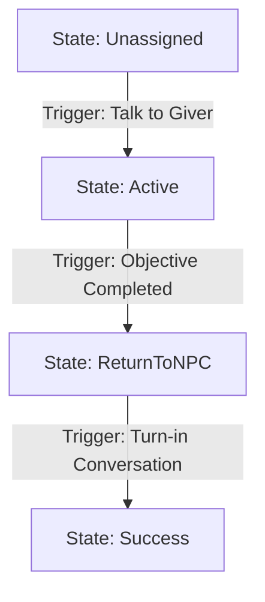

# Quest Logic Blueprint: [Quest Title]

Provide a short 1-2 sentence description of the narrative goal (e.g. "The player must find the hidden key in the forest to unlock the old ruins portal").

---

## 1. Meta & Dependencies

*   **Quest Giver NPC**: `[NPC Name]`
*   **Prerequisites**: `[e.g., None, or Quest "Unlock Portal" must be Success]`
*   **Turn-in NPC**: `[NPC Name]`
*   **Repeatable**: `[Yes/No] (Cooldown: [e.g. 24h, or None])`
*   **Quest Rewards**:
    *   Gold: `[Amount]`
    *   XP: `[Amount]`
    *   Items: `[ItemName] x[Qty]`

---

## 2. Asset & Database Catalog

Make sure these exact assets and database variables are created before scripting:

### A. NPCs (Actors)
*   `[NPC Name]` (Visual Overhead Indicator: `[Yes/No]`)
*   `[NPC Name]` (Visual Overhead Indicator: `[Yes/No]`)

### B. Lua Variables (Dialogue Editor)
| Variable Name | Type | Initial | Purpose |
| :--- | :--- | :--- | :--- |
| `[Variable_Name]` | `Boolean/Number` | `0 / false` | `[e.g. Tracks items collected]` |

---

## 3. Quest States & Sub-Objectives

### Quest Main State
*   `Unassigned` $\rightarrow$ `Active` $\rightarrow$ `ReturnToNPC` $\rightarrow$ `Success`

### Quest Entries (Sub-Objectives)
*   **Entry 1**: `[Text description]`
*   **Entry 2**: `[Text description]`

---

## 4. Chronological Step-by-Step Logic Flow

This section details exactly **what** transitions the quest states, chronologically from start to finish:



### Step 1: Quest Acceptance
*   **Actor**: `[NPC Name]`
*   **Trigger**: Start conversation `"Conversation_Title"` and reach Dialogue Node `[Node ID / Text]`.
*   **Action (Lua Script)**:
    ```lua
    SetQuestState("Quest_Title", "active");
    SetQuestEntryState("Quest_Title", 1, "active");
    ```
*   **Indicator Change**: Overhead Exclamation Mark `!` disappears.

### Step 2: Progress Tracking (Gameplay)
*   **Objective**: `[e.g. Defeat 3 Wolves]`
*   **Trigger**: `[e.g. Defeating an enemy with questEnemyId = "Wolf"]`
*   **Action (Quest Mapper / C#)**:
    Increments `{QuestName}_{FactType}_{TargetId}_Required_{Count}`.
*   **Visual Update**: Player HUD updates live.

### Step 3: Objective Completion & Chaining
*   **Trigger**: Counter reaches maximum limit `[Qty]`.
*   **Action (Quest Mapper)**:
    *   Sets **Entry 1** $\rightarrow$ `Success`.
    *   Sets **Entry 2** $\rightarrow$ `Active` (Chained objective).
    *   Sets overall Quest State $\rightarrow$ `ReturnToNPC`.
*   **Indicator Change**: Overhead Turn-in Question Mark `?` appears above `[Turn-in NPC Name]`.

### Step 4: Quest Turn-In & Rewards
*   **Actor**: `[Turn-in NPC Name]`
*   **Trigger**: Start conversation `"Conversation_Title"` while quest state is `ReturnToNPC`.
*   **Action (Dialogue Node Script)**:
    ```lua
    SetQuestState("Quest_Title", "success");
    SetQuestEntryState("Quest_Title", 2, "success");
    TorisGiveGold(100);
    ```
*   **Indicator Change**: All overhead indicators disappear.
