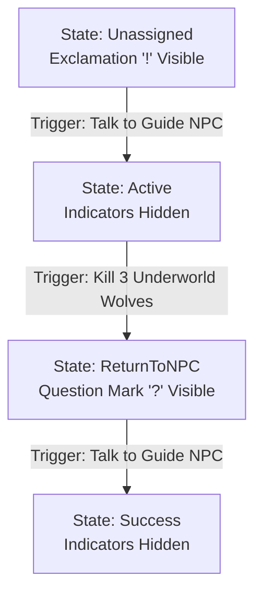

# Quest Logic Blueprint: Kill Underworld Wolves

The player must venture into the Underworld and defeat 3 Underworld Wolves, then return to the Guide NPC to report their success.

---

## 1. Meta & Dependencies

*   **Quest Giver NPC**: `Guide NPC`
*   **Prerequisites**: Quest "Unlock the Portal" must be in the `Success` state.
*   **Turn-in NPC**: `Guide NPC`
*   **Repeatable**: No
*   **Quest Rewards**:
    *   Gold: `150`
    *   XP: `100`
    *   Items: `UnderworldTotem` x1

---

## 2. Asset & Database Catalog

Verify that these exact assets and variables are configured:

### A. NPCs (Actors)
*   **Guide NPC** (Overhead Quest Indicator: **Yes**)

### B. Lua Variables (Dialogue Editor)
| Variable Name | Type | Initial | Purpose |
| :--- | :--- | :--- | :--- |
| `Kill_Underworld_Wolves_Kill_UnderworldWolf_Required_3` | `Number` | `0` | Auto-convention variable that tracks wolf kills in the Underworld. |

---

## 3. Quest States & Sub-Objectives

### Quest Main State
*   `Unassigned` $\rightarrow$ `Active` $\rightarrow$ `ReturnToNPC` $\rightarrow$ `Success`

### Quest Entries (Sub-Objectives)
*   **Entry 1 (Active)**: `Kill Underworld Wolves: [var.Kill_Underworld_Wolves_Kill_UnderworldWolf_Required_3]/3`
*   **Entry 2 (Unassigned)**: `Return to the Guide NPC`

---

## 4. Chronological Step-by-Step Logic Flow

The lifecycle of the quest transitions as follows:



### Step 1: Quest Acceptance
*   **Actor**: `Guide NPC`
*   **Trigger**: Start conversation `"Guide_Underworld_Introduction"` and accept the quest.
*   **Action (Lua Script on accept node)**:
    ```lua
    SetQuestState("Kill Underworld Wolves", "active");
    SetQuestEntryState("Kill Underworld Wolves", 1, "active");
    ```
*   **Indicator Change**: Overhead Exclamation Mark `!` disappears immediately.

### Step 2: Kill Progress Tracking (Gameplay)
*   **Target Enemy Prefab**: `Underworld Wolf` (Inherits from `Enemy.cs`).
*   **Prefab Inspector Fields**:
    *   `Quest Enemy Id` = `"UnderworldWolf"`
*   **Trigger**: Defeating an Underworld Wolf triggers `Enemy.Die()`.
*   **Action (Quest Mapper)**:
    `PixelCrushersQuestProgressMapper` intercepts `QuestFact.Kill("UnderworldWolf")` and increments the variable `Kill_Underworld_Wolves_Kill_UnderworldWolf_Required_3` by `1`.
*   **Visual HUD Update**: Quest log text on-screen updates to show counts: `1/3` $\rightarrow$ `2/3`.

### Step 3: Objective Completion & Chaining
*   **Trigger**: Variable reaches `3/3` kills.
*   **Action (Quest Mapper - Automated Chaining)**:
    *   Sets **Entry 1** $\rightarrow$ `Success` (turns green/crossed out).
    *   Sets **Entry 2** $\rightarrow$ `Active` (chained objective text pops up: *"Return to the Guide NPC"*).
    *   Sets overall Quest State $\rightarrow$ `ReturnToNPC`.
*   **Indicator Change**: Overhead glowing Turn-in Question Mark `?` instantly appears above `Guide NPC`.

### Step 4: Turn-In & Quest Completion
*   **Actor**: `Guide NPC`
*   **Trigger**: Player starts conversation `"Guide_Underworld_Introduction"` while the quest state is `ReturnToNPC`.
*   **Action (Dialogue Node Script)**:
    ```lua
    SetQuestState("Kill Underworld Wolves", "success");
    SetQuestEntryState("Kill Underworld Wolves", 2, "success");
    TorisGiveGold(150);
    ```
*   **Indicator Change**: All overhead indicators turn off and disappear.
