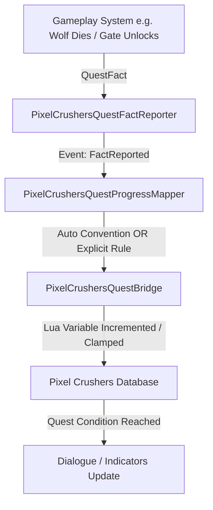
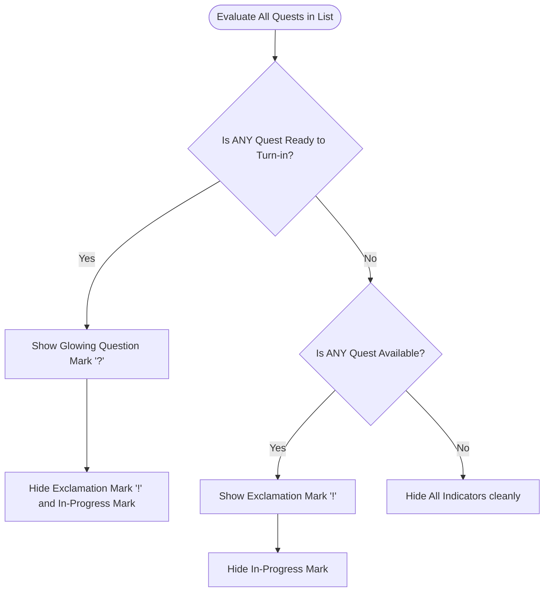

# Outland Haven: Developer Questing & Dialogue System Handbook

Welcome to the official developer documentation for the **Outland Haven Dialogue & Quest System**. 

Rather than relying on redundant scene triggers or bloated database scripts, *Outland Haven* runs on a **clean, decoupled, event-driven C# architecture**. This handbook documents your stable foundations and serves as a blueprint for adding new quests, indicators, and gameplay interactions.

---

## 1. System Architecture: Decoupled Fact Reporting

To prevent quest tracking logic from cluttering your core gameplay loops (combat, inventory, physics, map generation), *Outland Haven* operates on an **event-driven fact-reporting pipeline**. 



### The Three Architectural Pillars
1. **`QuestFact` (The Carrier)**:
   A lightweight, serializable struct describing a gameplay event:
   * `Type`: The action category (`Kill`, `PickUp`, `Collect`, `EnterScene`, `VisitSite`, etc.).
   * `ExactId`: The unique identifier (`UnderworldWolf`, `PortalKey`).
   * `TypeOrTag`: Broad tag class (`Wolf`, `Key`).
   * `Amount`: The quantity contributed (defaults to `1`).
   * `ContextId`: The scene or biome name.
2. **`PixelCrushersQuestFactReporter` (The Broadcaster)**:
   A static C# event-broker. Gameplay scripts simply report what happened without knowing which quest is listening:
   ```csharp
   PixelCrushersQuestFactReporter.Report(QuestFact.Kill("UnderworldWolf", "Wolf"));
   ```
3. **`PixelCrushersQuestProgressMapper` (The Translator)**:
   A persistent runtime listener. It catches reported `QuestFacts`, matches them against your active quests, and updates the database.

---

## 2. Overhead NPC Quest Indicator System

NPCs float dynamic visual signs (an exclamation mark `!` for available quests, a glowing question mark `?` for ready turn-ins) using a highly optimized, automated C# controller: **`QuestIndicatorController.cs`**.



### Key Features of our Custom Controller:
* **Single Component Multi-Quest List**: You can track 1, 2, or 10 quests on a single NPC using **just one component** by expanding the `List<string> _quests` in the Inspector.
* **Intelligent Priority Resolution**: Automatically prioritizes completed quest turn-ins (`ReturnToNPC` $\rightarrow$ glowing `?`) over new available quests (`Unassigned` $\rightarrow$ `!`), preventing visual overlays.
* **Silent Error Mismatch Warnings**: Includes built-in Dialogue Database validation. If you misspell a quest name in the inspector, it will automatically hide the markers and print a warning in your console telling you exactly what to fix.

---

## 3. Progressive Quest Tracking (Cheat Sheet)

You have two powerful approaches to progressive quest tracking inside *Outland Haven*:

### Method A: Convention-Based Variables (No Coding Required)
If you name your Dialogue variables according to this strict, logical naming convention, the `QuestProgressMapper` **handles all tracking automatically**:

👉 **Convention Formula**: `{QuestName}_{FactType}_{TargetId}_Required_{Count}`

* **Quest Name**: `Kill Underworld Wolves` (Sanitizes to `Kill_Underworld_Wolves`)
* **Fact Type**: `Kill`
* **Target ID**: `UnderworldWolf`
* **Count Needed**: `3`
* **Database Variable Name**: **`Kill_Underworld_Wolves_Kill_UnderworldWolf_Required_3`** (Type: `Number`)
* **Live HUD Text (Quest Entry 1)**: `Kill Underworld Wolves: [var.Kill_Underworld_Wolves_Kill_UnderworldWolf_Required_3]/3`

---

### Method B: Explicit Rule Sets (`QuestFactProgressRuleSetSO`)
For complex quests with custom variable names (e.g. tracking `wolvesKilled` without standard naming):
1. In your Dialogue Database, create a simple variable `wolvesKilled` (`Number`, `0`).
2. Create or open a **`QuestFactProgressRuleSetSO`** ScriptableObject asset (found under `Assets/Scripts/Quest/Database/`).
3. Add a new rule and fill out your mappings:
   * **Fact Type**: `Kill`
   * **Exact ID**: `UnderworldWolf`
   * **Quest Name**: `"Kill Underworld Wolves"`
   * **Progress Variable**: `wolvesKilled`
   * **Required Amount**: `3`
   * **Entry Number**: `1` (updates sub-objective 1)

---

## 4. Quest Entry State Chaining (Objective Progressions)

When an objective reaches its target (e.g. killing 3 wolves completes Entry 1), players expect the next step (e.g. Entry 2: "Return to the Guide NPC") to appear automatically. 

Our updated C# Mapper supports **native chained objective progression**:

### How It Works:
Both manual Mapper rules and automatic convention variables contain two optional fields:
* **`ActivateNextEntry`** (Boolean, defaults to `true`)
* **`NextEntryNumber`** (Integer, defaults to `2`)

When the counter reaches the limit:
1. It sets the main objective entry (`Entry 1`) to **`Success`** (marking it green or crossing it out in your HUD).
2. It instantly sets your next quest entry (`Entry 2`) to **`Active`**, popping up the next objective text on the player's HUD.
3. It transitions the overall Quest state to **`ReturnToNPC`**, which instantly triggers the floating glowing turn-in question mark `?` over the quest giver's head!

---

## 5. Direct C# Gameplay Integrations

For complex interactions where you want gameplay code to directly bypass fact-reporting and mutate quest state instantly (such as unlocking a gate with a key stack), use **`PixelCrushersQuestBridge`**.

### Practical Example: Portal Key Unlocking (`RunGateInteractable.cs`)
When a player interacts with the portal while holding the key item:
1. **Inventory Deduction**: Deducts `1` stack of the key item from the player inventory.
2. **Lua Variable Lock State**: Updates the global Lua lock variable `isPortalUnlocked` to `true`.
3. **C# Quest Chaining Mutation**:
   ```csharp
   // 1. Mark Entry 1 (Unlock the teleporter) as completed
   PixelCrushersQuestBridge.SetQuestEntryState("Unlock the Teleporter", 1, "success");
   
   // 2. Mark Entry 2 (Return to Guide NPC) as active
   PixelCrushersQuestBridge.SetQuestEntryState("Unlock the Teleporter", 2, "active");
   
   // 3. Set overall Quest state to ready for turn-in
   PixelCrushersQuestBridge.SetQuestState("Unlock the Teleporter", "returnToNPC");
   ```

---

## 6. Integrated Dialogue Lua Functions

You have a robust suite of custom Lua functions available directly inside your Dialogue Editor dialogue trees:

### Backpack & Gold Bridge
| Function | Description | Dialogue Tree Example |
| :--- | :--- | :--- |
| **`TorisHasItem("ItemID", qty)`** | Returns `true` if the player has at least `qty` of the item. | *Condition*: `TorisHasItem("PortalKey", 1)` |
| **`TorisGetItemCount("ItemID")`** | Returns the count of items in the backpack. | *Script*: `Variable["keys"] = TorisGetItemCount("PortalKey")` |
| **`TorisGiveItem("ItemID", qty)`** | Spawns a fresh item stack in the player's backpack. | *Script*: `TorisGiveItem("HealthPotion", 1)` |
| **`TorisTakeItem("ItemID", qty)`** | Deducts item stacks from the player inventory. | *Script*: `TorisTakeItem("PortalKey", 1)` |
| **`TorisGetGold()`** | Returns the player's current gold count. | *Condition*: `TorisGetGold() >= 100` |
| **`TorisGiveGold(amount)`** | Adds gold to the player's profile. | *Script*: `TorisGiveGold(150)` |
| **`TorisTakeGold(amount)`** | Deducts gold from the player. | *Script*: `TorisTakeGold(50)` |

### Screens & UI Bridge
| Function | Description | Dialogue Tree Example |
| :--- | :--- | :--- |
| **`TorisOpenScreen("ScreenID")`** | Opens custom UI screens passing contextual NPC data. | *Script*: `TorisOpenScreen("SmithShop")` |
| **`TorisCloseScreen("ScreenID")`** | Closes an active overlay interface. | *Script*: `TorisCloseScreen("SmithShop")` |
| **`TorisOpenQuestJournal("mode")`**| Opens the quest panel in `Available`, `Active`, or `Completed` view. | *Script*: `TorisOpenQuestJournal("Active")` |

---

## 7. Best Practices for Future Quest Development

1. **Prioritize Convention Mapping**:
   Whenever possible, use **Method A (Convention-Based Variables)**. It saves you from creating new ScriptableObject assets for every quest and keeps database setups completely self explanatory.
2. **Be Consistent with Quest Names**:
   Remember that the Dialogue System's database variable sanitization strips special characters and spaces. A quest named `"Kill Underworld Wolves"` becomes `Kill_Underworld_Wolves`. Keep your variable names formatted cleanly!
3. **Always Check the Unity Console**:
   If an NPC's overhead question/exclamation mark is not showing up, look at the Unity Console! The `QuestIndicatorController` will print a clear warning if there is a spelling mismatch between the Quest Giver's configuration and your Dialogue Database.
