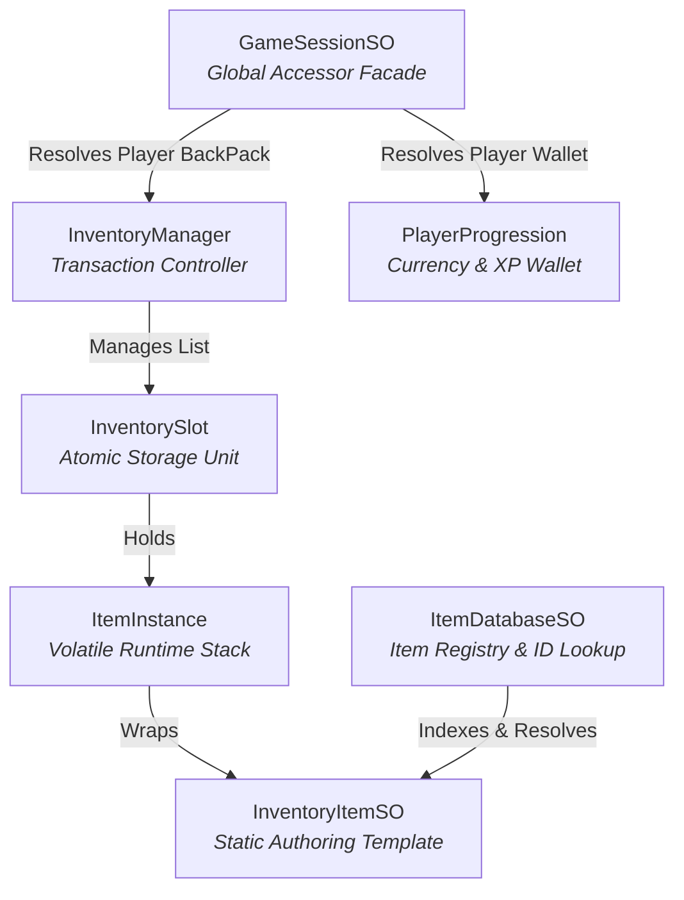

# Integrating Inventory, Items, and Currency with Pixel Crushers Dialogue System

This document explains the technical architecture of the **Toris Inventory System** and how it integrates with the **Pixel Crushers Dialogue and Quest System** using the newly created `PixelCrushersInventoryBridge`.

---

## 1. Architectural Architecture & Key Components

The inventory and item system is built around **Transactional Safety** and **Decoupled Architecture**. It divides data into five distinct components:



### 1.1 `GameSessionSO` (Facade / Global Service Registry)
- **Namespace:** `OutlandHaven.UIToolkit`
- **Role:** Serves as the central state hub. When an inventory component (backpack, equipment slot, potion bar) initializes, it binds itself to `GameSessionSO` (e.g. `GameSessionSO.PlayerInventory = this`).
- **Accessing it in C#:**
  ```csharp
  GameSessionSO session = GameSessionSO.LoadDefault();
  InventoryManager backpack = session.PlayerInventory;
  ```

### 1.2 `InventoryManager` (The Transaction Controller)
- **Namespace:** `OutlandHaven.Inventory`
- **Role:** Manages a collection of slots (`LiveSlots`). Rather than letting components write directly to slots, the manager exposes transactional methods that check for space and stack boundaries before mutating data, preventing partial inventory writes or stack corruption.
- **Key Public API Methods:**
  - `bool CanAddItem(ItemInstance itemInstance, int quantity)`: Pre-checks if the inventory has enough space.
  - `bool AddItem(ItemInstance itemInstance, int quantity)`: Deep-clones the `itemInstance` and distributes the quantity across matching non-full stacks or empty slots. Returns `true` if added successfully, `false` otherwise.
  - `bool RemoveItem(ItemInstance itemInstance, int quantity)`: Searches for matching item instances across slots, reducing stack sizes and clearing slots once a stack hits `0`. Returns `true` if successfully removed, `false` if total quantity is insufficient (aborts the entire transaction).
  - `void NotifyInventoryUpdated()`: Fires the UI update event `_uiInventoryEvents.OnInventoryUpdated`.

### 1.3 `ItemDatabaseSO` (ID Translator)
- **Namespace:** `OutlandHaven.Inventory`
- **Role:** Acts as the master registry of all items. When the dialogue system asks to check or remove `"GoldOre"`, the database resolves the string ID to the real `InventoryItemSO` asset.
- **Identity Rule:** An item's ID is defined by its **Asset File Name** (i.e. `itemSO.name`).
- **Key Public API Methods:**
  - `InventoryItemSO GetItemByID(string itemID)`: Performs an $O(1)$ lookup for the item using its string ID.

### 1.4 `InventoryItemSO` & `ItemInstance` (Templates vs Instances)
- **`InventoryItemSO` (Static Template):** Authored in the Unity Editor. Holds static info like `ItemName`, `Description`, `GoldValue`, and `MaxStackSize`.
- **`ItemInstance` (Mutable Stack):** Represents a physical item stack in a slot. It has a unique `InstanceID` (GUID) and a list of `ItemComponentState` structures (storing durability, upgrades, etc.).
- **Cloning:** Whenever an item is added, `InventoryManager` deep-clones the `ItemInstance`. This ensures that reducing durability on one iron sword doesn't reduce durability on all iron swords.

### 1.5 `PlayerProgression` (The Progression & Wallet Controller)
- **Role:** Exposes player stats, experience, and gold. Unlike item slots, currency (gold) is maintained on the `PlayerProgression` script.
- **Accessing it in C#:**
  ```csharp
  var progression = GameSessionSO.LoadDefault().ProgressionAnchor.Instance;
  int currentGold = progression.CurrentGold;
  ```
- **Key Public API Methods:**
  - `void AddGold(int amount)`: Increases player gold.
  - `bool TrySpendGold(int amount)`: Deducts gold if the player has enough. Returns `true` if successful, `false` if broke.

---

## 2. Dialogue & Quest System Bridge (`PixelCrushersInventoryBridge`)

To prevent gameplay systems from scattering direct Dialogue System dependencies, the custom component `PixelCrushersInventoryBridge` acts as a **Lua Function Registry**. It binds Toris-specific inventory and currency APIs directly into the Pixel Crushers Dialogue System environment.

### 2.1 Supported Lua Functions Reference

The following functions are registered automatically in the Lua environment and can be called from dialogue node **Conditions** or **User Scripts**:

| Lua Function Signature | Return Type | Category | Description | Example Usage |
| :--- | :--- | :--- | :--- | :--- |
| `TorisHasItem(itemID, quantity)` | `Boolean` | Inventory Check | Checks if the player has at least `quantity` copies of `itemID` in their Backpack. | **Condition:** <br> `TorisHasItem("Wood", 5)` |
| `TorisGetItemCount(itemID)` | `Number` | Inventory Check | Returns the total count of the item in the player's backpack. | **Condition:** <br> `TorisGetItemCount("WolfPelt") > 3` |
| `TorisGiveItem(itemID, quantity)` | `Boolean` | Inventory Action | Adds `quantity` of the item to the backpack. Returns `true` if successful. | **Script:** <br> `TorisGiveItem("HealthPotion", 1)` |
| `TorisTakeItem(itemID, quantity)` | `Boolean` | Inventory Action | Deducts `quantity` of the item. Returns `true` if successfully removed. | **Script:** <br> `TorisTakeItem("IronOre", 3)` |
| `TorisGetGold()` | `Number` | Wallet Check | Returns the player's current gold total. | **Condition:** <br> `TorisGetGold() >= 100` |
| `TorisGiveGold(amount)` | `Boolean` | Wallet Action | Adds `amount` gold to the player's wallet. | **Script:** <br> `TorisGiveGold(250)` |
| `TorisTakeGold(amount)` | `Boolean` | Wallet Action | Deducts `amount` gold from the wallet. Returns `false` if insufficient gold. | **Script:** <br> `TorisTakeGold(50)` |

---

## 3. Setup and Integration Guide

Follow these steps to enable inventory-driven dialogue choices and quest hand-ins:

### Step 1: Add the Bridge to the Scene
1. In the Unity Hierarchy, select your **Dialogue Manager** GameObject (or any persistent global GameObject).
2. Attach the `PixelCrushersInventoryBridge` component.
3. Assign your master `ItemDatabaseSO` asset to the **Item Database** field in the Inspector.
   > [!TIP]
   > If left unassigned, the bridge will attempt to dynamically load the database asset from `Assets/Resources/Data/ItemDatabase.asset`.

### Step 2: Use in Dialogue Nodes

#### Scenario A: The Player needs items to progress (Condition)
If an NPC only talks to the player if they have 5 pieces of wood:
1. Select the dialogue node leading to the wood handover.
2. In the **Conditions** field, type:
   ```lua
   TorisHasItem("Wood", 5)
   ```

#### Scenario B: The NPC takes the items and rewards the player (Script)
Once the player agrees to hand over the items in exchange for 100 gold and a potion:
1. Select the dialogue node completing the transaction.
2. In the **Script** field, write:
   ```lua
   TorisTakeItem("Wood", 5);
   TorisGiveGold(100);
   TorisGiveItem("HealingPotion", 1)
   ```

---

## 4. Technical Integration Best Practices

- **Database Synchronization:** Ensure your `ItemDatabaseSO` is up-to-date. You can open your `ItemDatabaseSO` inspector and click **Auto-Populate Database** to automatically scrape and index all `InventoryItemSO` assets inside the project.
- **Quest Completion Event Fact Reporting:** If you need to let the Pixel Crushers Quest system know an item was collected or delivered, use the existing `PixelCrushersDialogueCommandBridge` function `TorisReportFact`.
  - Example: `TorisReportFact("Collect", "Wood", "QuestItem", 5, "WoodcutterQuest")`
